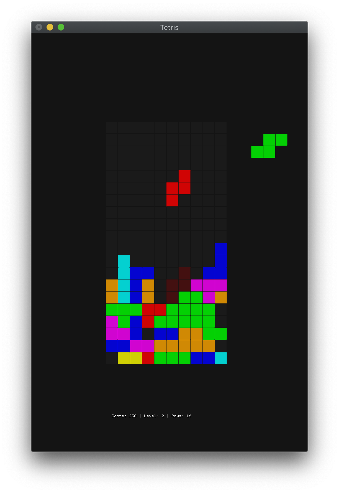
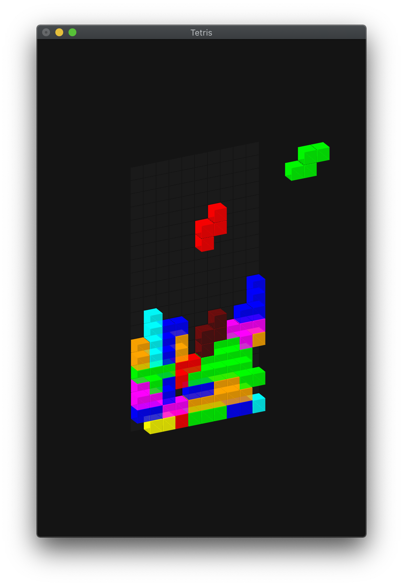

# Tetris in OpenGL

    
    &nbsp;
    

A Tetris implementation in OpenGL that I did in undergrad.

To compile, run `make` in this directory.
Then run `./play` to start the game.

The game is rendered in 3D although the default view is 2D.
You can rotate the scene by dragging the mouse inside the game window.

The usual Tetris controls work as expected:
- **Left/Right/Down**: Move the current piece.
- **Up**: Rotate the current piece.
- **Space**: Immediately drop the current piece.

In addition, you can control the game via the following keys:
- **P**: Pause/unpause the game.
- **R**: Restart the game.
- **V**: Reset the view to 2D.
